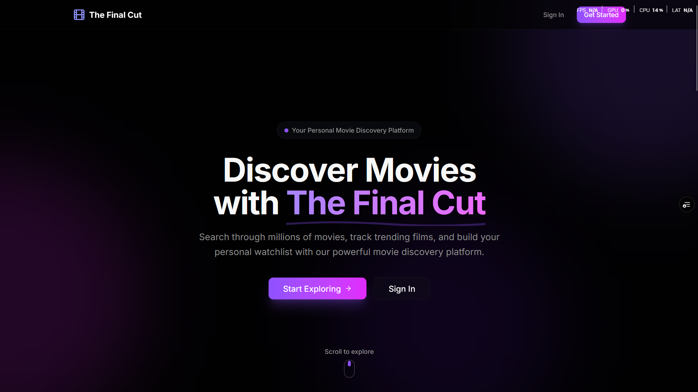
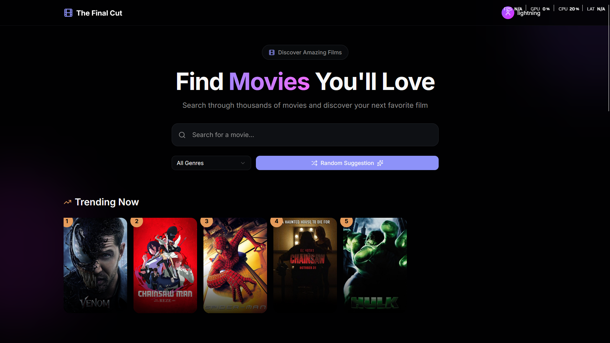
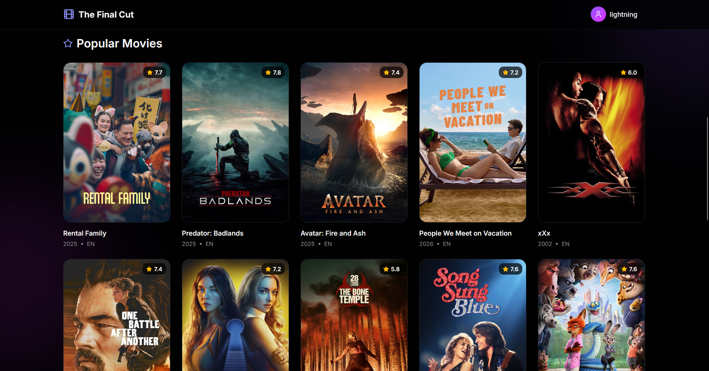
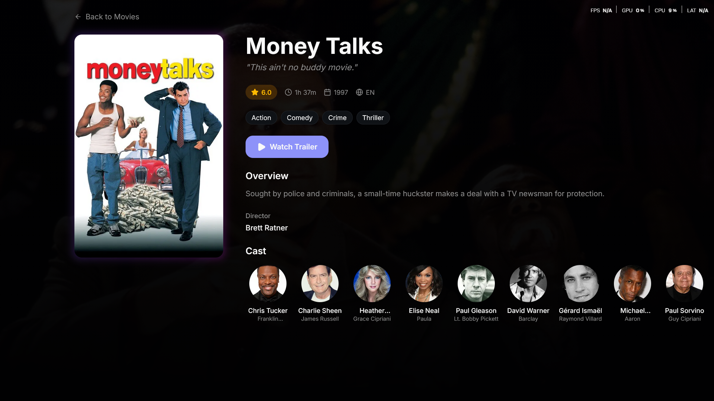
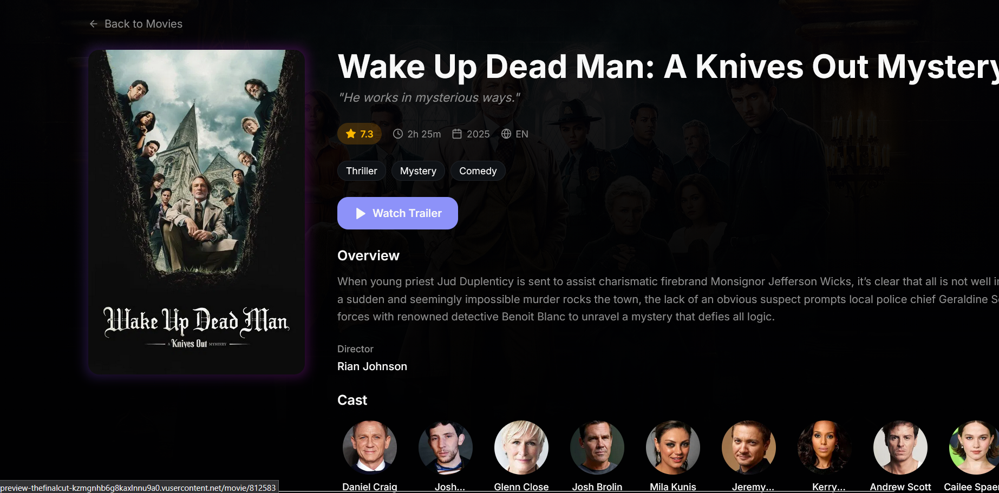
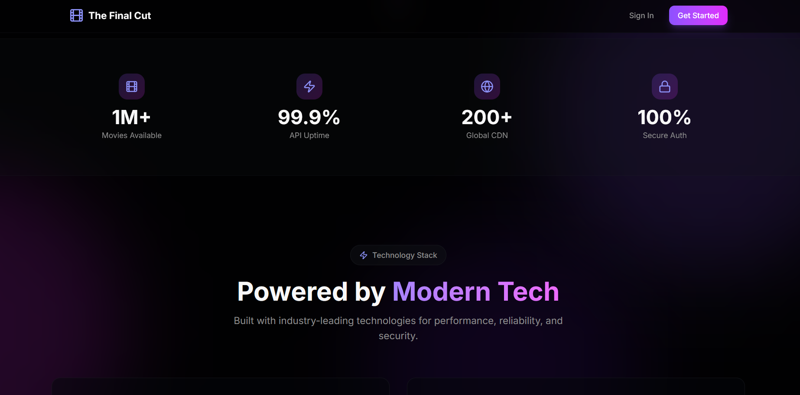
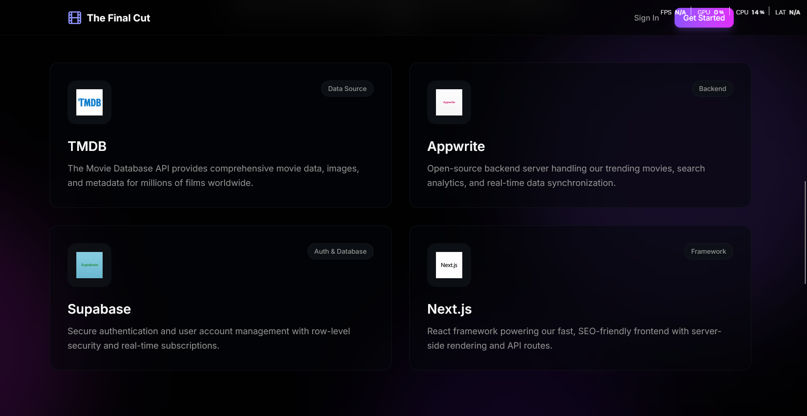
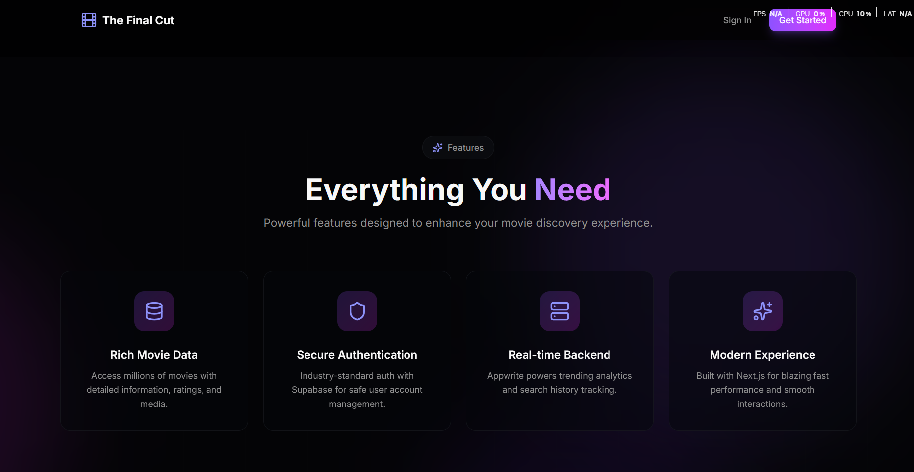
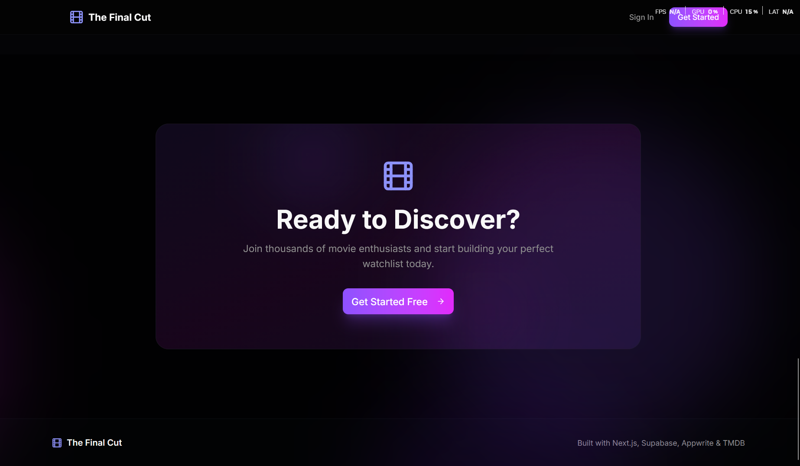

# The Final Cut 🎬

The Final Cut is a premium movie discovery platform built with modern web technologies. It allows users to explore the latest trending films, search for specific movies, view detailed information (including cast and trailers), and maintain a personal watchlist and favorites list.



Additional UI preview placeholders are included across the app to ensure a consistent visual experience even when external services are inactive.

## 🚀 Features

* **Dynamic Discovery**: Explore trending movies and search across thousands of titles using the TMDB API.
* **Detailed Insights**: View comprehensive movie details, including plot summaries, cast information, directors, and high-quality imagery.
* **Personalized Experience**: Sign up and log in to create your own personal Watchlist and Favorites.
* **Smart Suggestions**: Get random movie suggestions based on your favorite genres.
* **Modern UI/UX**: Built with a sleek, responsive design, supporting both dark and light modes.
* **Graceful Degradation**: Uses multiple local placeholder images to prevent broken layouts when Supabase storage becomes inactive after periods of no traffic.
* **Secure Authentication**: Powered by Supabase Auth for a seamless and secure login experience.

## 🖼️ Placeholder Images

To avoid empty states or broken visuals when Supabase storage spins down (for example, if the site receives no visits for more than 7 days), the project includes multiple local placeholder images. These are used as fallbacks for:

**Site previews**


---

---

---

---

---

---

---

---



This ensures the UI remains stable and presentable regardless of backend availability.

## 🛠️ Tech Stack

* **Framework**: [Next.js 15](https://nextjs.org/) (App Router)
* **Library**: [React 19](https://react.dev/)
* **Styling**: [Tailwind CSS 4](https://tailwindcss.com/)
* **Components**: [Radix UI](https://www.radix-ui.com/) (Icons via [Lucide React](https://lucide.dev/))
* **Database & Auth**: [Supabase](https://supabase.com/)
* **API Services**: [TMDB (The Movie Database)](https://www.themoviedb.org/)
* **Analytics/Backend**: [Appwrite](https://appwrite.io/) & [Vercel Analytics](https://vercel.com/analytics)
* **Language**: [TypeScript](https://www.typescriptlang.org/)

## 📦 Getting Started

### Prerequisites

* Node.js 18.x or later
* npm / pnpm / yarn

### Installation

1. **Clone the repository:**

   ```bash
   https://github.com/lightning4747/The-Final-Cut.git
   ```

2. **Install dependencies:**

   ```bash
   npm install
   ```

3. **Set up Environment Variables:**
   Create a `.env` file in the root directory based on `env.example`:

   ```env
   # TMDB API Key (Required for movie data)
   TMDB_API_KEY=your_tmdb_api_key_here

   # Supabase Configuration (Required for favorites/watchlist)
   NEXT_PUBLIC_SUPABASE_URL=your_supabase_url_here
   NEXT_PUBLIC_SUPABASE_ANON_KEY=your_supabase_anon_key_here

   # Appwrite Configuration (Optional / Used for analytics & metrics)
   NEXT_PUBLIC_APPWRITE_PROJECT_ID=your_id
   NEXT_PUBLIC_APPWRITE_DATABASE_ID=your_id
   NEXT_PUBLIC_APPWRITE_COLLECTION_ID=your_id
   NEXT_PUBLIC_APPWRITE_ENDPOINT=https://cloud.appwrite.io/v1
   ```

4. **Run the development server:**

   ```bash
   npm run dev
   ```

   Open [http://localhost:3000](http://localhost:3000) in your browser.

## 📂 Project Structure

* `app/`: Next.js App Router (pages and server actions)
* `components/`: Reusable UI components (buttons, cards, modals)
* `lib/`: Shared utilities and service initializations (Supabase, TMDB)
* `hooks/`: Custom React hooks
* `public/`: Static assets and placeholder images
* `styles/`: Global CSS and design tokens

## 🤝 Freelance & Collaboration

I am open to undertaking web and full‑stack development projects for a price. If you are interested in custom builds, feature extensions, or similar products, feel free to reach out via GitHub.

## 📄 License

This project is licensed under the MIT License. See the LICENSE file for details.

---

Built by [lightning4747](https://github.com/lightning4747)
